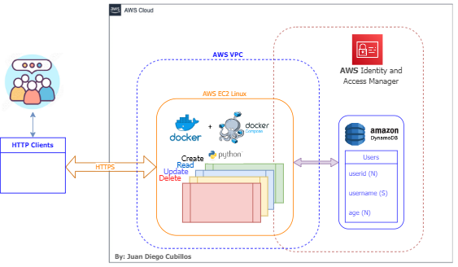
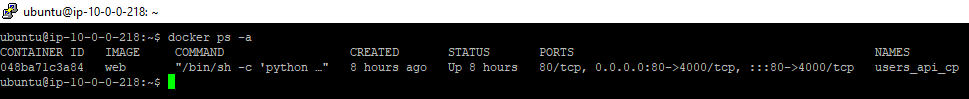
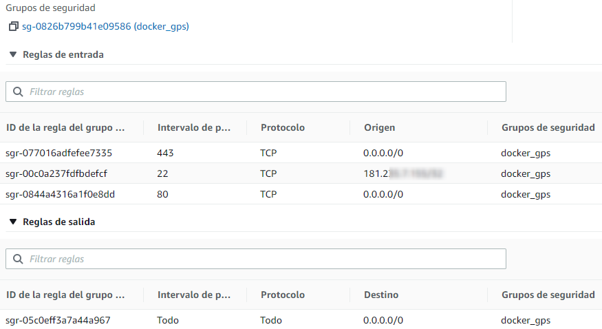
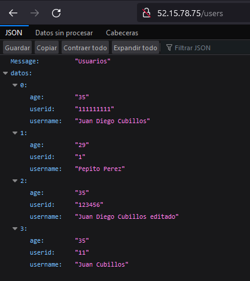
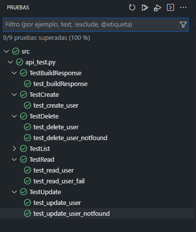

# API Python usando DynamoDB(AWS) desplegada con Docker+Docker-Compose en una instancia EC2 de AWS 

## By: Juan Diego Cubillos Maestre - Especialista en Ingeniería de Software
### [Github](https://github.com/juandinetUPC)
### [LinkedIn](https://linkedin.com/in/juan-diego-cubillos-630654195)

## Tecnologías utilizadas
- Python 3.9.0
- UnitTest for Python
- Git (Github)
- AWS EC2
- Ubuntu 20.04.3 LTS
- Docker 17.09.0
- Docker compose 17.09.0
- AWS CLI 1.16.9
- AWS SDK for Python 1.16.9
- AWS Boto3 1.14.15
- AWS IAM 
- AWS DynamoDB 1.12.20
 

## Diseño de la Solución



##Instalación de la Solución

En una instancia de AWS EC2, se instala Docker, Docker-Compose y Git.
https://docs.docker.com/engine/install/
https://github.com/git-guides/install-git

Probamos que el docker está instalado y clonamos el repositorio de nuestra solución.

```powershell
docker --version
docker-compose --version
mkdir -p /home/ubuntu/API/
cd /home/ubuntu/API/
git clone https://github.com/juandinetUPC/api-aws-python-docker-dynamodb.git
cd api-aws-python-docker-dynamodb/

```

Editamos es el archivo `config_example.py` para agregar las credenciales IAM-AWS y lo renombramos a `config.py`
para conectar la instancia a la base de datos.

```powershell
nano config_example.py
```

Constrimos las imagenes necesarias para la ejecución de la aplicación.

```powershell
docker-compose build
docker-compose up -d
```

Revisamos la ejecución del contenedor.

```powershell
docker ps -a
```


Debemos asegurarnos que los puertos de la API(80, 443 en este caso) esten abiertos en la VPC-AWS hacia las IP autorizadas a acceder en este caso está abierto a todas las IP(0.0.0.0/0) por ser una API de pruebas.



Hacemos pruebas  manuales de la API.


Y podemos correr los test unitarios en local poniendo como `base_url` la IP de nuestra instancia: `http://52.15.78.75/`


